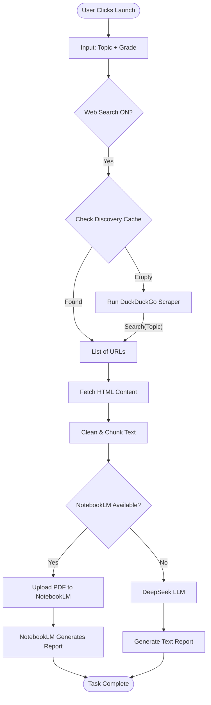

# Intelligence Source: AUTO Execution Path

*This path attempts to find resources automatically using search engines or a local discovery cache. It is the default "Research" mode.*

## Logic Flow

1.  **Trigger**: User selects "AUTO" (or leaves default) and ensures "Web Search" is ON.
2.  **Discovery**:
    *   System checks `outputs/discovery/urls.json` for cached URLs.
    *   If empty, it initiates a **Scraper** (e.g., DuckDuckGo) using the `Topic` as the query.
3.  **Collection**:
    *   Found URLs are visited using Playwright.
    *   HTML is cleaned and split into text chunks.
4.  **AI Routing**:
    *   **If NotebookLM Available**: Chunks are uploaded to NotebookLM as a PDF for processing.
    *   **If NotebookLM Unavailable**: Chunks are sent to the DeepSeek API (or other configured LLM) for text generation.

## Mermaid Diagram

