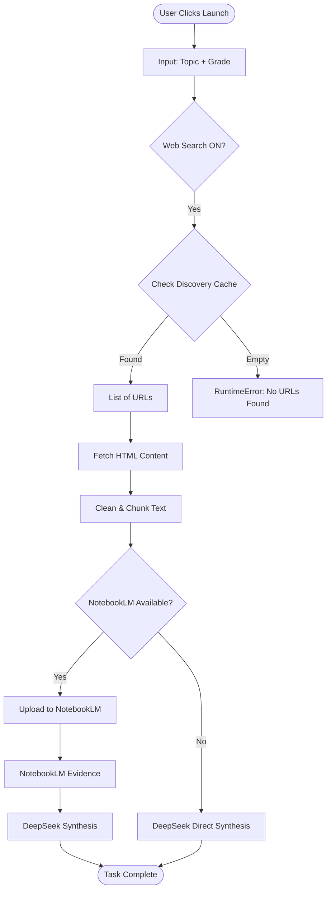

# Intelligence Source: AUTO Execution Path

*This path attempts to find resources automatically using search engines or a local discovery cache. It is the default "Research" mode.*

## Logic Flow

1.  **Trigger**: User selects "AUTO" (or leaves default) and ensures "Web Search" is ON.
2.  **Discovery**:
    *   System checks `outputs/discovery/urls.json` for cached URLs.
    *   **CRITICAL**: In the current version, the automated scraper is **disabled**.
    *   **If Cache Empty**: The process raises a `RuntimeError` and stops.
    *   **If Cache Found**: It proceeds to Collection.
3.  **Collection**:
    *   Found URLs are visited using Playwright.
    *   HTML is cleaned and split into text chunks.
4.  **AI Routing**:
    *   **Mode A (NotebookLM Available)**: Chunks are uploaded to NotebookLM -> Evidence generated -> Evidence sent to DeepSeek -> Final Report.
    *   **Mode B (NotebookLM Unavailable)**: Chunks are sent directly to DeepSeek -> Final Report.

## Mermaid Diagram

