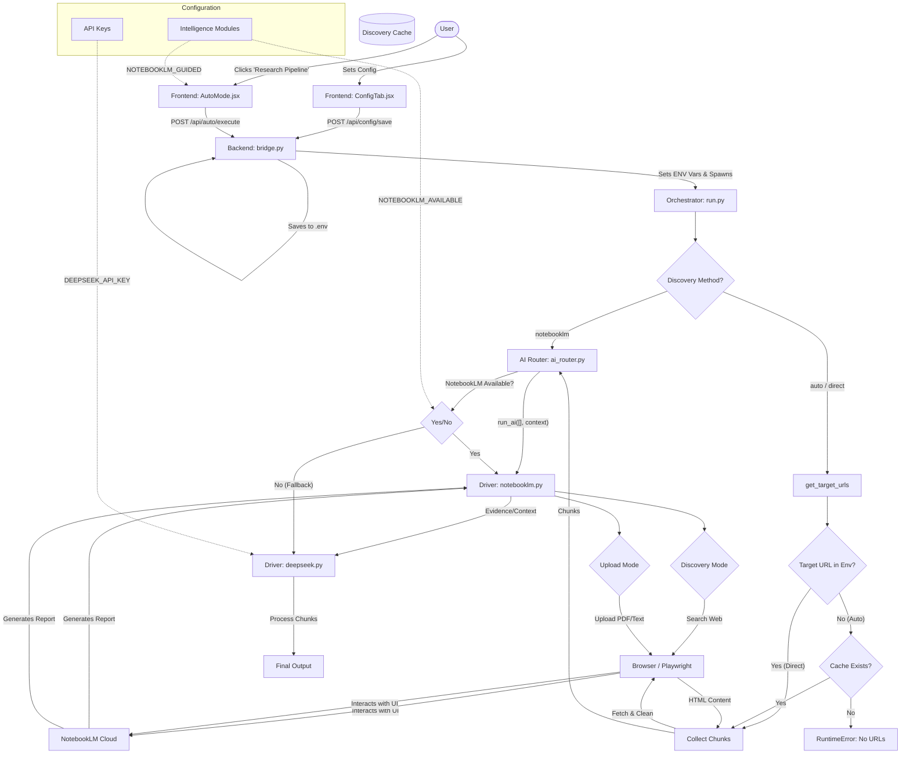

# Intelligence Source Program Flow & Logic

## Mermaid Diagram



## Detailed Explanation

### 1. Intelligence Sources: Inputs, Gates, & Process

#### **A. NOTEBOOKLM**
*   **Logic**: Uses Google NotebookLM's internal "Search the web" feature to discover sources dynamically based on the topic.
*   **Inputs**:
    *   `Topic`, `Grade`, `Subtopics` (from UI).
    *   `Context` (constructed in `run.py`).
*   **Decision Gates**:
    *   **Gate 1**: `discovery_method == 'notebooklm'` (in `run.py`). Routes directly to `run_ai` without local URL collection.
    *   **Gate 2**: Inside `notebooklm.py`, checks `discovery_method`. If 'notebooklm', executes **Source Discovery Flow**.
*   **Output to Next Process**:
    *   Generates a PDF Report inside NotebookLM.
    *   Exports PDF/Summary.
    *   Returns synthesis summary to `run_ai`.

#### **B. AUTO / GOOGLE / DUCKDUCKGO (Web Search OFF)**
*   **Logic**: Direct extraction from user-provided URLs.
*   **Inputs**:
    *   `Target URLs` (comma-separated).
*   **Decision Gates**:
    *   **Gate 1**: `discovery_method == 'direct'` (in `run.py`).
    *   **Gate 2**: `get_target_urls()` finds `TARGET_URL` in environment variables.
*   **Output to Next Process**:
    *   URLs are fetched, cleaned, and chunked.
    *   Chunks are passed to `run_ai`.
    *   **If NotebookLM Available**: Chunks are compiled into a PDF, uploaded to NotebookLM, and processed (Upload Flow).
    *   **If NotebookLM Unavailable**: Chunks are processed directly by DeepSeek (if enabled).

#### **C. AUTO / GOOGLE / DUCKDUCKGO (Web Search ON)**
*   **Logic**: Intended to perform automated web discovery (e.g., via DuckDuckGo), but currently relies on pre-populated Discovery Cache.
*   **Inputs**:
    *   `Topic`, `Grade`, `Subject`.
*   **Decision Gates**:
    *   **Gate 1**: `discovery_method == 'auto'` (in `run.py`).
    *   **Gate 2**: `get_target_urls()` finds no `TARGET_URL` in env. Checks `outputs/discovery/urls.json`.
    *   **Critical Logic**: If cache is empty, `run.py` raises `RuntimeError` as it does not currently invoke `discovery_router.py` to populate URLs dynamically.
*   **Output to Next Process**:
    *   If URLs exist in cache: Same flow as Direct mode (Fetch -> Chunk -> AI).

---

### 2. Research Pipeline Execution

**Event Triggered**: User clicks "LAUNCH RESEARCH PIPELINE" in `AutoMode.jsx`.

**Data Flow**:
1.  **Frontend**:
    *   Validates inputs (`validateInput`).
    *   Constructs payload:
        ```json
        {
          "targetUrl": "...",        // Empty if Web Search ON
          "sourceType": "notebooklm", // or auto/google/ddg
          "config": {
             "discoveryMethod": "...", // notebooklm, auto, or direct
             "modes": { "D": true }    // Agentic Mode (NotebookLM Available)
          },
          ... // grade, topic, etc.
        }
        ```
    *   Sends `POST` request to `/api/auto/execute`.

2.  **Backend (`bridge.py`)**:
    *   Receives payload.
    *   Maps payload fields to Environment Variables (e.g., `CR_TOPIC`, `TARGET_URL`, `DISCOVERY_METHOD`).
    *   Sets `NOTEBOOKLM_AVAILABLE` based on `config.modes.D`.
    *   Spawns `run.py` as a subprocess.

3.  **Orchestration (`run.py`)**:
    *   Loads Environment Variables.
    *   Initializes Browser (Playwright).
    *   Executes logic based on `DISCOVERY_METHOD` (as described in the diagram).

---

### 3. Linkage to Config Tab Variables

The **Config Tab** (`ConfigTab.jsx`) manages global settings that influence the pipeline's behavior. These are linked via Backend Environment Variables.

| Config Variable (UI) | Internal Variable | Linkage Mechanism | Impact on Logic |
| :--- | :--- | :--- | :--- |
| **Intelligence Modules** | | | |
| `NotebookLM Available` | `notebooklmAvailable` | Saved to `.env` -> `NOTEBOOKLM_AVAILABLE` | In `ai_router.py`: Decides whether to route chunks to `run_notebooklm` or fallback directly to `run_deepseek`. |
| `DeepSeek Available` | `deepseekAvailable` | Saved to `.env` -> `DEEPSEEK_AVAILABLE` | In `ai_router.py`: Enables fallback if NotebookLM is unavailable. |
| `NotebookLM Guided Mode` | `notebooklmGuided` | Saved to `.env` -> `NOTEBOOKLM_GUIDED` | In `AutoMode.jsx`: If `true`, clicking Launch **STOPS** execution and opens `GuidedModePopup` with manual prompts. |
| **API Keys** | | | |
| `DeepSeek API Key` | `deepseekApiKey` | Saved to `.env` -> `DEEPSEEK_API_KEY` | In `deepseek.py`: Used to authenticate requests to the DeepSeek API. |
