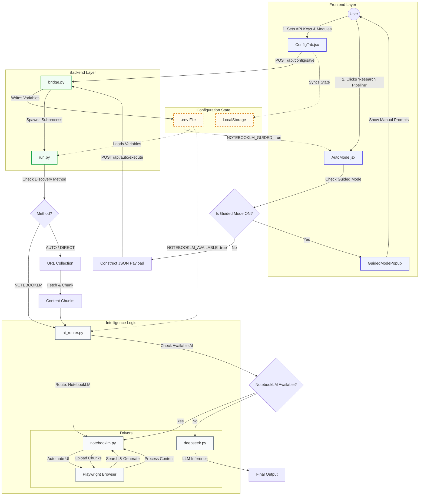

# Intelligence Source Program Flow & Logic

## 1. System Architecture Diagram

This diagram visualizes how user actions, configuration settings, and backend logic interact to execute the Research Pipeline.

---

## 2. Detailed Process Explanations

### **A. Intelligence Source: NOTEBOOKLM**
*   **What it does:** This source treats Google NotebookLM as an end-to-end research assistant. It uses the browser to "drive" the NotebookLM website, asking it to search the web for your topic.
*   **Inputs:**
    *   **Topic**: The main subject (e.g., "Photosynthesis").
    *   **Grade/Subtopics**: Used to refine the search query inside NotebookLM.
*   **Decision Gates (The "If/Then" Logic):**
    *   *Gate 1:* **Is the Discovery Method set to 'NotebookLM'?**
        *   **If YES:** The system skips local web scraping entirely. It launches the browser, logs into NotebookLM, and types your topic into its "Search sources" bar.
        *   **If NO:** It proceeds to other methods.
*   **Output to Next Process:**
    *   The result is a PDF report generated by NotebookLM, which is downloaded and saved to `outputs/final`.

### **B. Intelligence Source: AUTO (Web Search ON)**
*   **What it does:** This mode acts like a traditional search engine. It automatically finds relevant URLs for your topic, reads them, and then synthesizes the information.
*   **Inputs:**
    *   **Topic**: Used as the search query (e.g., "Grade 8 Physics Force").
    *   **Grade**: Adds context to the search (e.g., "for middle school").
*   **Decision Gates:**
    *   *Gate 1:* **Are there specific URLs provided?**
        *   **If NO:** The system checks its `outputs/discovery/urls.json` cache or runs a search scraper (DuckDuckGo) to find new URLs.
    *   *Gate 2:* **Is NotebookLM Available?** (See Configuration Linkage below).
        *   **If YES:** The system collects the text from these websites, creates a PDF, uploads it to NotebookLM, and asks NotebookLM to write the report.
        *   **If NO:** The system sends the text directly to the DeepSeek AI (if enabled) to write the report.
*   **Output to Next Process:**
    *   A list of "Chunks" (text segments) is passed to the AI Router.

### **C. Intelligence Source: GOOGLE / DUCKDUCKGO / DIRECT (Web Search OFF)**
*   **What it does:** This is the "Precision Mode". You give it specific URLs, and it analyzes exactly those pages—nothing else.
*   **Inputs:**
    *   **Target URLs**: A comma-separated list of links (e.g., `https://byjus.com/..., https://wikipedia.org/...`).
*   **Decision Gates:**
    *   *Gate 1:* **Is 'Web Search' toggled OFF in the UI?**
        *   **If YES:** The system ignores the Topic for searching and strictly visits the URLs you provided.
*   **Output to Next Process:**
    *   Same as AUTO mode: Text chunks are extracted and sent to the AI Router for synthesis.

---

## 3. Configuration Linkage: "Intelligence Modules" & "API Keys"

The settings in the **Config Tab** directly control the "Decision Gates" in the diagram above. Here is how they link:

### **A. "Intelligence Modules" (The Switches)**

1.  **Variable:** `NotebookLM Guided Mode`
    *   **In the Code:** `NOTEBOOKLM_GUIDED` (Environment Variable).
    *   **What it controls:** The **"User Interruption" Gate**.
    *   **Example:** If you switch this **ON**, clicking "Launch Pipeline" will **STOP** the automated process. Instead, a popup appears with prompts for you to copy-paste manually. The code effectively says: *"Stop! Do not run the backend. Show the user instructions instead."*

2.  **Variable:** `NotebookLM Available`
    *   **In the Code:** `NOTEBOOKLM_AVAILABLE` (Environment Variable).
    *   **What it controls:** The **"AI Router" Gate**.
    *   **Example:** You have collected 10 pages of text about "Volcanoes".
        *   **If ON:** The system thinks, *"I will upload these 10 pages to NotebookLM to get a summary."*
        *   **If OFF:** The system thinks, *"I cannot use NotebookLM. I will check if DeepSeek is available to summarize these pages instead."*

### **B. "API Keys" (The Credentials)**

1.  **Variable:** `DeepSeek API Key`
    *   **In the Code:** `DEEPSEEK_API_KEY` (Environment Variable).
    *   **What it controls:** Access to the **DeepSeek Driver**.
    *   **Example:** If the "AI Router" Gate decides to use DeepSeek (because NotebookLM is off or failed), the code looks for this key.
        *   **If Key Exists:** The system sends your text to DeepSeek's cloud for processing.
        *   **If Key Missing:** The process will fail with an authentication error.

### **C. Summary of Events: "Research Pipeline is Clicked"**

When you click that button, a chain reaction occurs:

1.  **Frontend (AutoMode.jsx):** It gathers your Grade, Topic, and URL settings.
2.  **Validation:** It checks if you forgot to enter a Topic.
3.  **API Call:** It packages everything into a JSON message and shoots it to the Backend (`bridge.py`).
4.  **Environment Setup:** The Backend reads your "Intelligence Modules" settings (from `.env`) and prepares the computer's environment.
5.  **Launch:** The Backend starts the `run.py` script (the Orchestrator), which begins the actual work based on the Decision Gates described above.
