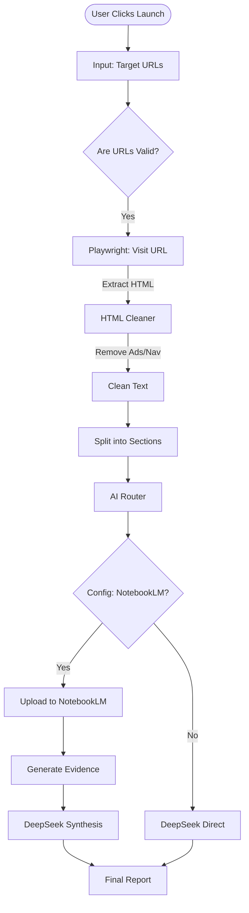

# Intelligence Source: DIRECT Execution Path

*This is the "Precision Mode" where the user provides specific URLs, bypassing the discovery/search phase.*

## Logic Flow

1.  **Trigger**: User toggles "Web Search" **OFF** in the UI and enters URLs in the "Target URLs" field.
2.  **Validation**: Frontend ensures at least one URL is provided.
3.  **Direct Access**:
    *   The `run.py` script detects the `TARGET_URL` environment variable.
    *   It skips cache checks and scrapers.
    *   It immediately visits the provided URLs.
4.  **Synthesis**:
    *   Content is extracted and sent to the configured AI backend (NotebookLM or DeepSeek).

## Mermaid Diagram

