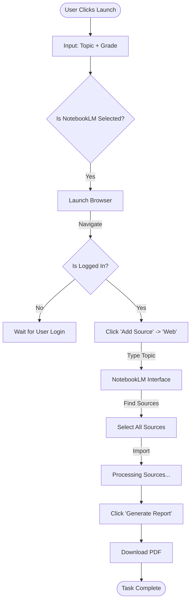

# Intelligence Source: NOTEBOOKLM Execution Path

*This path delegates the entire research process to Google's NotebookLM via browser automation. It relies on the internal search capabilities of NotebookLM.*

## Logic Flow

1.  **Trigger**: User selects "NOTEBOOKLM" in the UI and clicks Launch.
2.  **Gate**: The system checks if `NOTEBOOKLM_GUIDED` is OFF. If ON, it stops and asks for manual input.
3.  **Browser Action**:
    *   Navigates to `notebooklm.google.com`.
    *   Checks for login state.
    *   Creates a new notebook or selects an existing one.
4.  **Source Addition**:
    *   Selects "Add Source" -> "Web".
    *   Types the `Topic` + `Grade` into the search bar.
    *   Selects discovered sources and imports them.
5.  **Synthesis**:
    *   Uses a "Custom Report" prompt to generate the final PDF.

## Mermaid Diagram

