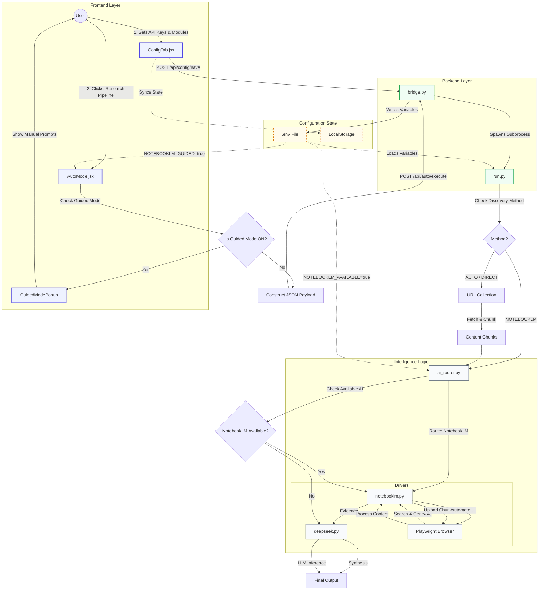

# Intelligence Source Program Flow & Logic

## 1. System Architecture Diagram

This diagram visualizes how user actions, configuration settings, and backend logic interact to execute the Research Pipeline.

---

## 2. General Process Explanations

### **A. Intelligence Source: NOTEBOOKLM**
*   **What it does:** This source treats Google NotebookLM as an end-to-end research assistant. It uses the browser to "drive" the NotebookLM website, asking it to search the web for your topic.
*   **Detailed Flow:** See `flow_notebooklm.md`

### **B. Intelligence Source: AUTO (Web Search ON)**
*   **What it does:** This mode acts like a traditional search engine. It automatically finds relevant URLs for your topic, reads them, and then synthesizes the information.
*   **Detailed Flow:** See `flow_auto.md`

### **C. Intelligence Source: GOOGLE / DUCKDUCKGO (Explicit Search)**
*   **What it does:** Functionally similar to AUTO, but explicitly selects the search strategy. This path emphasizes the discovery phase.
*   **Detailed Flow:** See `flow_search.md`

### **D. Intelligence Source: DIRECT (Web Search OFF)**
*   **What it does:** This is the "Precision Mode". You give it specific URLs, and it analyzes exactly those pages—nothing else.
*   **Detailed Flow:** See `flow_direct.md`

---

## 3. Configuration Linkage: "Intelligence Modules" & "API Keys"

The settings in the **Config Tab** directly control the "Decision Gates" in the diagram above. Here is how they link:

### **A. "Intelligence Modules" (The Switches)**

1.  **Variable:** `NotebookLM Guided Mode`
    *   **In the Code:** `NOTEBOOKLM_GUIDED` (Environment Variable).
    *   **What it controls:** The **"User Interruption" Gate**.
    *   **Example:** If you switch this **ON**, clicking "Launch Pipeline" will **STOP** the automated process. Instead, a popup appears with prompts for you to copy-paste manually. The code effectively says: *"Stop! Do not run the backend. Show the user instructions instead."*

2.  **Variable:** `NotebookLM Available`
    *   **In the Code:** `NOTEBOOKLM_AVAILABLE` (Environment Variable).
    *   **What it controls:** The **"AI Router" Gate**.
    *   **Example:** You have collected 10 pages of text about "Volcanoes".
        *   **If ON (Mode A):** The system uploads the text to NotebookLM to generate evidence, **THEN** sends that evidence to DeepSeek for the final report.
        *   **If OFF (Mode B):** The system skips NotebookLM and sends the text **DIRECTLY** to DeepSeek.

### **B. "API Keys" (The Credentials)**

1.  **Variable:** `DeepSeek API Key`
    *   **In the Code:** `DEEPSEEK_API_KEY` (Environment Variable).
    *   **What it controls:** Access to the **DeepSeek Driver**.
    *   **Example:** In **Mode A**, DeepSeek is used for the second step. In **Mode B**, it is used for the only step. Without this key, both modes will fail at the synthesis stage.
