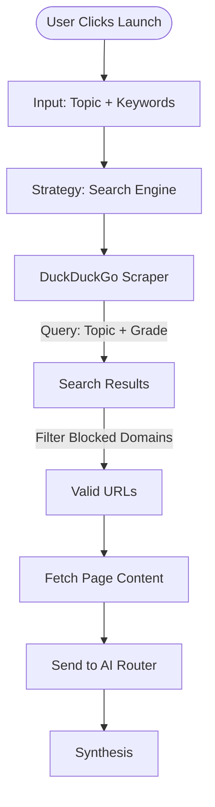

# Intelligence Source: GOOGLE / DUCKDUCKGO Execution Path

*Functionally similar to AUTO, but explicitly selects the search strategy. This path emphasizes the discovery phase.*

## Logic Flow

1.  **Trigger**: User explicitly selects "GOOGLE" or "DUCKDUCKGO" in the UI.
2.  **Strategy Selection**: The backend receives the specific source type.
3.  **Scraping**:
    *   Executes the specific scraper logic (currently shared via `ddg_scraper.py` for bot-friendliness).
    *   Filters results against "Blocked Domains" (e.g., removing social media).
4.  **Processing**:
    *   Valid URLs are passed to the standard Fetch -> Chunk -> AI Router pipeline.

## Mermaid Diagram

